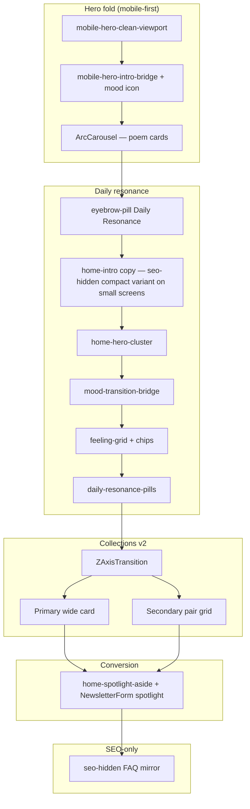

# Versery Design System — v2

**Status:** Living document aligned with the current homepage build (`screen-content--home`, collections v2, ArcCarousel, newsletter spotlight, Z-axis collection transition).  
**Scope:** Product foundations, tokens, components, motion, accessibility, and implementation map. Cross-app patterns that share `src/styles.css` are included where they define global tokens.

**Ship note (appearance):** The production build may run with **`THEME_LIGHT_ONLY`** (`src/lib/theme.js`), which forces light appearance and hides the theme control. Dark-mode CSS tokens remain in the stylesheet for future re-enablement; this document documents **both** semantic themes.

---

## 1. Product intent

| Dimension | Direction |
|-----------|-----------|
| **Category** | Editorial web reader — poetry, calm discovery |
| **Tone** | Quiet, confident, warm-neutral; never “social feed” energy |
| **Visual metaphor** | Gallery + reader: cards float on soft surfaces; type carries hierarchy |
| **Motion** | Purposeful staging (hero exit → daily resonance reveal); respect `prefers-reduced-motion` |
| **Density** | Comfortable reading; generous vertical rhythm on home |

**Primary promise (home):** *Curated poetry for how you feel* — mood-first entry, daily actions, then threaded collections and newsletter capture.

---

## 2. Design principles

1. **Typography leads.** Cabinet Grotesk for display and section rhythm; Satoshi for UI and body. Tight negative letterspace on large headings is intentional.
2. **Surfaces stack, they don’t shout.** Neutrals (`--surface*` family) + restrained accent. Color appears in **mood chips** and **imagery**, not chrome.
3. **One focal column.** Content width is capped (`--content-width`); home sections center within the shell.
4. **Motion explains sequence.** Staggered reveals teach order: carousel → mood bridge → chips → daily pills → collections → newsletter.
5. **Glass is functional.** Newsletter success uses blur, inset highlights, and a subtle animated edge trace — celebration without carnival.
6. **Accessibility is non-negotiable.** Focus rings, `aria-live` where state changes, keyboardable cards, WCAG-aware contrast on image-backed cards via readability modes.

---

## 3. Foundations

### 3.1 Art direction

- **Warm editorial neutrals** on `#f9f9f9` family surfaces.
- **Poetic accent** via paper/watercolor undertones in newsletter spotlight washes (soft blue / violet / peach in radial layers — see `NewsletterForm.jsx`).
- **Imagery:** Full-bleed collection photography with bottom-weighted scrim; text switches between **readability-light** and **readability-dark** modes based on image luminance (JS-driven class on cards).

### 3.2 Iconography

- **UI icons:** Material Symbols Outlined (`FILL` 0, `wght` 300, `opsz` 24) — subset loaded in `index.html`.
- **Spot illustration / success:** Lucide React (e.g. `CheckCheck` on newsletter success).

### 3.3 Logo / wordmark

- **“Versery”** in the top app bar: centered title on home; pointer indicates “return home” on desktop when not on home.

---

## 4. Design tokens

Tokens live primarily in `:root` and `html[data-theme="dark"]` inside **`src/styles.css`**. Prefer **semantic aliases** (`--color-text-primary`, etc.) for new UI; legacy `--ink` / `--surface*` remain canonical for most existing rules.

### 4.1 Color — semantic (light baseline)

| Token | Typical use | Light value (hex / note) |
|-------|-------------|---------------------------|
| `--surface` | Page chrome, `html` background | `#f9f9f9` |
| `--surface-lowest` | Cards, elevated panels | `#ffffff` |
| `--surface-low` | Secondary panels, chips default | `#f2f4f4` |
| `--surface-high` / `--surface-highest` | Stacked depth, hovers | `#e4e9ea` → `#dde4e5` |
| `--ink` | Primary text | `#2d3435` |
| `--ink-soft` | Secondary text, captions | `#5a6061` |
| `--accent` / `--accent-strong` | Links, subtle emphasis | Gray-violet family |
| `--line` | Hairlines, borders | `rgba(117,124,125,0.14)` |
| `--color-text-primary` | Alias → `--ink` | |
| `--color-text-secondary` | Alias → `--ink-soft` | |
| `--color-text-tertiary` | Alias → `--voice-stat-caption` | |
| `--color-background-primary` | Alias → `--surface-lowest` | |
| `--color-border-tertiary` | Alias / light border mix | |

**Warm accent family (quotes / poem-next):** Peach–paper gradients (`--voice-quote-*`, `--poem-next-*`) for featured pull-quotes and “next poem” surfaces — distinct from cool neutrals.

**Dark theme:** Full mirror under `html[data-theme="dark"]` (surfaces darken, ink lightens, shadows deepen). Document dark pairs when implementing dual-theme features.

### 4.2 Color — mood chips (feeling buttons)

Each `data-feeling` uses a **muted pastel base** + **inverted active** (white field + pastel “ink”) for `:focus-visible`, `.is-active`, and fine-pointer `:hover`.

| Feeling | Background | Ink / border accent |
|---------|------------|---------------------|
| Melancholic | `#f1e7f8` | `#5f4d73` / `#e6d9f0` |
| Ethereal | `#e5f5ec` | `#2d5c48` / `#d9f0e6` |
| Radiant | `#f7efe5` | `#6a4f38` / `#f0e6d9` |
| Solitary | `#e5edf7` | `#3d4d6d` / `#d9e6f0` |
| Calm | `#e1f2f6` | `#2f5f69` / `#d8eff4` |
| Pulse | `#f8e5ef` | `#6a3f58` / `#f4dbe8` |

**Interaction:** `transform: scale(0.99)` on generic hover; chip-specific hovers reset to `scale(1)`. Active `:active` uses `scale(0.97)`.

### 4.3 Elevation & shadow

| Token | Role |
|-------|------|
| `--shadow-soft` | Large soft float |
| `--shadow-medium` | Deeper cards / modals |
| `--shadow-header` | Top app bar |
| `--shadow-bottom` | Bottom navigation lift |
| `--feeling-card-shadow` | Featured mood card on home |

### 4.4 Radius

| Usage | Value |
|-------|--------|
| **Large cards / sections** | `1.5rem`–`1.75rem` (`--border-radius-lg` = `1.75rem`) |
| **v2 collection cards** | `16px` |
| **Chips / inputs** | `1rem` or `999px` (pill) |
| **Bottom nav (mobile)** | `1.75rem` top corners |

### 4.5 Layout width

| Token | Default | Notes |
|-------|---------|--------|
| `--content-width` | `30rem` | Main column cap |
| `@media (min-width: 768px)` | `56rem` | Wider shell for tablet/desktop |

**Home intro copy block:** `max-width: 412px` with internal `clamp` on headline.

### 4.6 Spacing rhythm (home-relevant)

| Pattern | Value |
|---------|--------|
| Section stack (`collections-section`, etc.) | `margin-top: 3rem` |
| `home-mid-stack` gap | `3rem` vertical between stacked feature blocks |
| Mood grid gap | `calc(0.9rem + 8px)` × `calc(0.8rem + 8px)` |
| Bridge → grid | `padding-top: 80px` on bridge; `margin-top: 84px` / `margin-bottom: 64px` on grid (home) |

### 4.7 Safe areas & chrome offsets (mobile home)

Inside `@media (max-width: 1023px)` for `.screen-content--home`:

| Variable | Composition |
|----------|-------------|
| `--home-mobile-top-offset` | `calc(6rem + env(safe-area-inset-top))` |
| `--home-mobile-bottom-offset` | `calc(5.5rem + env(safe-area-inset-bottom))` — **tablet** (`768px`–`1023px`): `6.5rem` to account for floating bottom nav `bottom: 1rem` |
| `padding-bottom` on home main | `calc(var(--home-mobile-bottom-offset) + 3rem)` — clears fixed bottom nav after last card |

### 4.8 Z-index (reference)

| Layer | Approx. | Examples |
|-------|---------|----------|
| Base content | 0–3 | Card bodies over media |
| Top app bar / bottom nav | `20` | Fixed chrome |
| Menus / overlays | higher in stack | Context-dependent |
| Home poem transition overlay | `40` | Preview sheet |
| Flying card / transition peak | `50` | Z-axis transition |

### 4.9 Motion tokens

| Token | Value |
|-------|--------|
| `--ease-out` | `cubic-bezier(0.23, 1, 0.32, 1)` |
| `--ease-in-out` | `cubic-bezier(0.77, 0, 0.175, 1)` |
| `--ease-smooth` | `cubic-bezier(0.45, 0, 0.55, 1)` |
| `--motion-smooth-short` | `260ms` |
| `--motion-smooth-medium` | `280ms` |
| `--motion-faq` / `--motion-faq-collapse` | `280ms` / `260ms` |
| `--theme-crossfade-duration` | `280ms` (theme / VT) |

**Named entrance:** `rise-in` — `260ms` translateY + opacity (used on sections).

---

## 5. Typography

### 5.1 Font stacks

| Role | Family | Weights in use |
|------|--------|----------------|
| **Display / headings** | `"Cabinet Grotesk", sans-serif` | 400, 650–800 (CSS uses numeric weights per rule) |
| **UI / body** | `"Satoshi", sans-serif` | 400, 500, 600, 700 |
| **Icons** | Material Symbols Outlined | Variable |
| **Accent UI** | Satoshi on uppercase micro-labels | 700 |

**Loading:** Fontshare CDN (Cabinet Grotesk + Satoshi) with preload + noscript fallback (`index.html`).

### 5.2 Type scale — homepage highlights

| Element | Rule of thumb |
|---------|----------------|
| **Top eyebrow** (`.eyebrow-pill`, “Daily Resonance”) | `~0.55rem`, wide letterspacing `0.187em`, uppercase |
| **Home intro headline** | `clamp(1.49rem, 4.95vw, 2.12rem)`, letter-spacing `-0.05em`, balance |
| **Home intro lead** | `0.92rem`, line-height `1.65`, pretty wrap |
| **Mood bridge** (“What are you carrying today?”) | `clamp(2.1rem, 8vw, 3rem)`, Cabinet, weight `700`, letter-spacing `-0.06em` |
| **Feeling chips** | `1rem` / weight `500` |
| **Collections thread bridge** | `1.2rem` Cabinet, weight `400`, letter-spacing `-0.03em` |
| **v2 primary title (no image)** | `clamp(1.7rem, 6vw, 2.2rem)` |
| **v2 primary title (on image)** | `clamp(1.3rem, 4.5vw, 1.6rem)` |
| **Newsletter spotlight label** | Uppercase micro — `0.65rem`, `0.18em` tracking, Satoshi 700 |
| **Section labels** (global pattern) | `0.65rem`, `0.22em` tracking, uppercase |

### 5.3 Typesetting rules

- Use **`text-wrap: balance`** on short headings; **`text-wrap: pretty`** on body when specified.
- **Italic** for supporting / quote-adjacent copy in spotlight body.
- **Small caps + letterspace** for poet line above excerpt on primary collection card.

---

## 6. Layout system

### 6.1 Page shell

- **`.page-shell`:** `min-height: 100dvh`; background `var(--page-shell-glow), var(--surface)` on default home-adjacent shell.

### 6.2 Screen content

- **`.screen-content`:** `width: min(100%, var(--content-width))`; horizontal padding `1.5rem` (wider `2rem` from `768px`); default vertical padding `calc(6rem + safe-top)` / `calc(8rem + safe-bottom)` — home overrides bottom padding on narrow viewports (see §4.7).

### 6.3 Home main regions (information architecture)



---

## 7. Components — specifications

### 7.1 Top app bar

- **Fixed** top; blur + `--top-app-bar-bg`.
- **Height:** `calc(4rem + env(safe-area-inset-top))`.
- **Home grid:** leading (What’s New / menu), title, trailing (install + optional theme).
- **Touch:** Icon buttons use `.icon-surface` pattern (minimum comfortable hit area in implementation).

### 7.2 Bottom navigation

- **Mobile:** Full width, `bottom: 0`, large radius top corners, inner padding includes `env(safe-area-inset-bottom)`.
- **≥768px:** Floating pill — `width: min(100% - 3rem, 32rem)`, centered, `bottom: 1rem`, translucent background + border.
- **Items:** `3.5rem` square touch targets, rounded `1rem`, active state `--bottom-nav-active-bg`.
- **Visibility (home, desktop):** Dock can hide until user scrolls past part of hero (JS in `App.jsx`); mobile keeps dock visible.

### 7.3 ArcCarousel (hero)

- **Behavior:** Horizontal drag / snap; 3D arc layout; per-card audio with transport controls (Lucide).
- **Pagination:** Dots with scaled geometry; class `arc-carousel-pagination--exited` when hero “exits” after scroll threshold.
- **Motion:** Card content scale derived from `CARD_HEIGHT / 480`; reduced-motion paths in TSX.
- **Accessibility:** Poem open actions wired to `onOpenPoem`; live region patterns where specified in component.

### 7.4 Eyebrow pill

- **`.eyebrow-pill`:** Caps label, `surface-low` fill, soft ink, rounded pill — stages in with `.home-v2-stage`.

### 7.5 Mood transition bridge & chips

- **Bridge:** Fades/slides in when `is-visible`; color `--color-text-secondary`.
- **Chips:** Staggered `transition-delay` from `--chip-stagger-index` (320ms steps).
- **Grid:** Flex wrap, centered.

### 7.6 Daily resonance pills

- **Primary / secondary** pair; icons `today` / `shuffle`.
- **Shape:** Pill `999px`; borders `--daily-pill-border*`.
- **Primary shimmer:** One-shot CSS animation on load (`daily-pill-shimmer`).
- **States:** Disabled opacity `0.42`; `focus-visible` ring uses `--accent` / `--surface-high`.

### 7.7 v2 collection cards

- **Structure:** Optional full-bleed image → gradient scrim (`::before`) → frosted layer (`::after` with gradient mask) → body content.
- **Primary card:** `min-height: 320px`; secondary `205px`.
- **Grid:** Primary full width; `v2-collection-secondary-grid` — 2 columns, `12px` gap.
- **Readability modes:**
  - `--readability-dark`: dark scrim, white type + shadow.
  - `--readability-light`: light scrim, charcoal type + light shadow.
- **Motion:** `ZAxisTransition` on click — staged timers (`nextPageMountMs` default `1900`, `completeNavigationMs` default `2200`) for GPU-friendly handoff.

### 7.8 Newsletter — spotlight variant

- **Container:** `.home-spotlight-aside` — `surface-low`, hairline border, `1.5rem` radius, `1.35rem` padding.
- **Headline row:** `.home-spotlight-aside__head-pair` — label uses `.poet-feature__badge.home-spotlight-aside__solo-label` for **single-line uppercase** treatment (“A POEM IN YOUR INBOX, EVERY WEEK.”).
- **Form:** Pill input + circular submit; fold animation on success (`motion/react` 3D rotate on form; success stack replaces).
- **Success (aside level):** `.home-spotlight-aside--success` — glass gradient, inset highlights, `backdrop-filter`, **rotating conic edge** on `::before` (`success-glass-edge-trace` **4.8s** linear infinite) — disabled under `prefers-reduced-motion` for related transitions.
- **Head success:** Optional hide of headline row via `home-spotlight-aside__head--success` + React `newsletterSpotlightHeadSuccess`.

### 7.9 Buttons — global patterns

- **`.primary-action` / `.secondary-action`:** Used across app; rounded, shadow on primary.
- **`.inline-action`:** Textual / light buttons in archive footers.
- **Focus:** Visible outlines (`outline: 2px solid var(--accent)` or context-specific) with offset.

### 7.10 SEO utility

- **`.seo-hidden`:** Visually hidden but available to crawlers / screen reader policy per product choice; used for hero H1 duplicate and FAQ mirror. Pair with JSON-LD in app for FAQ rich results.

---

## 8. Motion & micro-interaction catalog

| Interaction | Duration / curve | Notes |
|-------------|------------------|-------|
| Home v2 stage reveal | `520ms`, `cubic-bezier(0.25,1,0.5,1)` | Opacity + translateY + blur |
| Mood bridge reveal | `420ms`, `cubic-bezier(0.25,1,0.5,1)` | |
| Mood chips stagger | `1180ms`, delay `320ms + index*320ms` | |
| Collection card `animate-in` | `500ms` ease-out | Intersection-driven `.in-view` |
| Newsletter form fold | `0.6s`, `[0.32,0.72,0,1]` | `rotateX` fold |
| Home poem transition | `1.8s` on main | Scale + blur “zoom into poem” |
| Theme crossfade | `280ms` | View Transitions API when available |
| Success glass edge | `4.8s` linear loop | Decorative; respect global a11y prefs |

**Reduced motion:** Dedicated `@media (prefers-reduced-motion: reduce)` blocks strip transitions on home transition clusters, FAQ content, spotlight head, etc.

---

## 9. Accessibility

| Area | Requirement |
|------|-------------|
| **Color** | Text on images must use readability class; maintain ≥4.5:1 where possible for body-on-scrim |
| **Focus** | All interactive cards/buttons have visible `:focus-visible` |
| **Motion** | Path for `prefers-reduced-motion: reduce` on staged home animations and carousel |
| **Forms** | Labels: visually hidden where pill UI; `aria-label` on submit |
| **Live regions** | Mood icon / carousel contexts use `aria-live` where implemented |
| **SEO blocks** | `aria-hidden="true"` on hidden FAQ mirror — **confirm** intentional exclusion from AT |

---

## 10. Content & voice

- **Headline:** Short, emotional, second person where appropriate (“What are you carrying today?”).
- **Subheads:** Sentence case for product explanation; uppercase only for micro-labels (tracking widened).
- **Newsletter:** Calm confirmation — “You’re in. A poem finds you soon.”
- **Analytics hooks:** `trackEvent` on theme change, feeling select, newsletter submit lifecycle (see `App.jsx` / `NewsletterForm.jsx`).

---

## 11. Technical implementation map

| Concern | Primary files |
|---------|----------------|
| **Global tokens & component CSS** | `src/styles.css` |
| **Tailwind** | `src/tailwind.css` (utilities layer; selective use in JSX) |
| **Home composition** | `src/App.jsx` (`screen-content--home`) |
| **Carousel** | `src/components/ArcCarousel.tsx` |
| **Collection flip** | `src/components/ZAxisTransition.tsx` |
| **Newsletter** | `src/components/NewsletterForm.jsx` |
| **Theme orchestration** | `src/lib/theme.js`, boot snippet `index.html` |
| **Images / responsive helpers** | `src/lib/responsive-public-images.jsx` (and related) |

---

## 12. Governance & versioning

1. **Token changes:** Update `:root` / dark mirror together; snapshot before/after in PR description.
2. **New home sections:** Match `home-mid-stack` spacing; respect mobile bottom padding contract (§4.7).
3. **Motion:** Default to ≤400ms for utilitarian UI; longer only for narrative beats (carousel exit, Z-transition).
4. **v2 doc:** Bump footer version when shipping meaningful visual changes.

**Document version:** 2.0.0 — *Initial industry-level system from current homepage build.*

---

## Appendix A — CSS custom property quick reference (light)

Copy-oriented excerpt (non-exhaustive):

```
--surface: #f9f9f9
--surface-lowest: #ffffff
--ink: #2d3435
--ink-soft: #5a6061
--line: rgba(117, 124, 125, 0.14)
--content-width: 30rem (56rem ≥768px)
--border-radius-lg: 1.75rem
```

---

## Appendix B — Homepage class cheat sheet

| Class | Role |
|-------|------|
| `screen-content screen-content--home` | Home main root |
| `mobile-hero-clean-viewport` | Hero fold flex column |
| `mobile-hero-intro-bridge` | Tagline + mood icon row |
| `mobile-hero-carousel-wrap` | ArcCarousel wrapper |
| `feeling-section` | Ref anchor for scroll / nav logic |
| `home-hero-cluster` | Cluster spacing for mood + pills |
| `mood-transition-bridge` / `mood-transition-chip` | Staggered reveal |
| `collections-section--v2` | Collections stack |
| `v2-collection-card*` | Card system |
| `home-mid-stack` | Newsletter + optional features stack |
| `home-spotlight-aside*` | Newsletter spotlight shell |
| `is-collection-transitioning` / `is-poem-transitioning` | Body / home transient states |

---

*End of Versery Design System v2*
